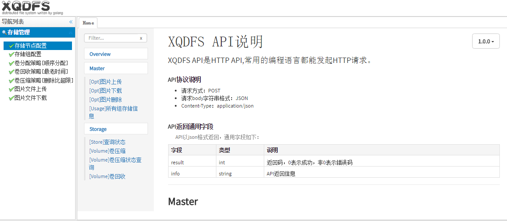

# 一、XQDFS介绍  
### 1、简介

&nbsp;&nbsp;&nbsp;&nbsp;&nbsp;&nbsp;&nbsp;&nbsp;XQDFS是一个开源的高性能分布式文件系统。 它的主要功能包括：文件上传、文件下载、文件清理，以及高容量和负载平衡。主要解决了海量数据存储问题，特别适合以中小文件为载体的在线服务。  
&nbsp;&nbsp;&nbsp;&nbsp;&nbsp;&nbsp;&nbsp;&nbsp;XQDFS系统包括：调度服务器(Master)、存储服务器(Storage)、客户端(Client)、Web管理界面。

* Master：调度服务器，管理所有存储服务器，负载均衡作用。  
* Storage：存储服务器，主要提供容量和备份服务。  
* Client：客户端，上传下载数据的服务器，也就是我们自己的项目所部署在的服务器。

### 2、客户端SDK
goland:[[SDK及说明文档]](https://github.com/yixiuqi/xqdfs-client-go/blob/master/README.md)  

# 二、安装XQDFS环境  
### 1、安装SSDB 
解压ssdb.tar.gz，修改配置文件ssdb.conf
```bash
server:
	ip: 0.0.0.0
	port: 18888 改为打算使用的端口
```

**启动SSDB ./start.sh**，启动后会打印 
```bash 
ssdb-server 1.9.4
Copyright (c) 2012-2015 ssdb.io
```

**停止SSDB ./stop.sh**

***

### 2、启动Storage
解压Storage.tar.gz，修改配置文件store.toml
```bash
[Log]
Level = "error"            日志等级trace，debug，info，error

[Server]
Id = 1                     当前节点编号，编号必须唯一   
Desc = "test[25]"          当前节点描述
Host = "192.168.10.25"     本机IP地址
Port = 10086               本地使用端口

[Dir]
Path = ["volume_data"]
Capacity = [128]           本机用于存储的空间(单位G)，默认128G

[Configure]
Param = "192.168.10.25:18888"    SSDB地址
```

**启动节点 ./Storage.sh start**  
**停止节点 ./Storage.sh stop**

***

### 3、启动Master

解压Master.tar.gz，修改配置文件store.toml
```bash
[Log]
Level = "error"                 日志等级trace，debug，info，error

[Server]
Host = "192.168.10.25"          本机IP地址                                    
Port = 10087                    本地使用端口

[Configure]
Param = "192.168.10.25:18888"   SSDB地址
```

**启动节点 ./Storage.sh start**  
**停止节点 ./Storage.sh stop**

# 三、系统配置
Storage、Master、SSDB都启动后，打开浏览器输入http://192.168.10.25:10087/page/index.htm  
其中IP和端口为Master对应地址，网页界面如下： 


#### 存储节点信息浏览

系统启动完成后可以在存储节点配置中看到所有存储节点信息：
* 节点编号(对应Storage配置文件Server.Id)
* 节点地址(对应Storage配置文件Server.Host和Server.Port)
* 节点描述(对应Storage配置文件Server.Desc)
* 总容量(GB)(对应Storage配置文件Dir.Capacity)
* 已经使用空间(GB)
* 使用率
* 图片总数
* 图片删除总数

#### 配置存储组


添加完组后在组中添加存储节点

